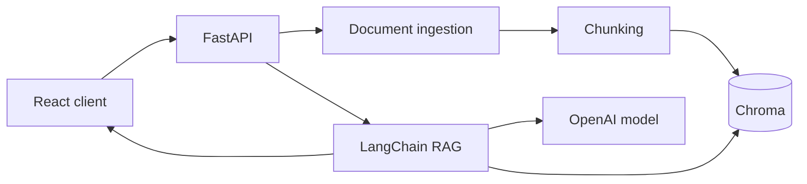

# Enterprise GenAI RAG Copilot

A production-oriented full-stack Retrieval-Augmented Generation application that answers questions from private documents and returns grounded source citations.

## Why this project stands out

- Upload and index PDF, TXT, and Markdown documents
- Semantic search with Chroma and OpenAI embeddings
- LangChain retrieval pipeline with source-grounded answers
- Conversation-aware follow-up questions
- FastAPI contracts, health checks, and structured errors
- Modern React interface with source cards and retrieval scores
- Dependency injection makes the backend easy to test
- Docker Compose for one-command local development

## Architecture



## Quick start

1. Copy the environment file:

```bash
cp .env.example .env
```

2. Add your `OPENAI_API_KEY`.
3. Start both applications:

```bash
docker compose up --build
```

- Frontend: http://localhost:5173
- API docs: http://localhost:8000/docs

## Local development

```bash
cd backend
python -m venv .venv
source .venv/bin/activate
pip install -r requirements.txt
uvicorn app.main:app --reload
```

```bash
cd frontend
npm install
npm run dev
```

## API

| Method | Endpoint | Purpose |
|---|---|---|
| GET | `/health` | Service readiness |
| POST | `/api/documents` | Upload and index a document |
| POST | `/api/chat` | Ask a cited question |
| DELETE | `/api/documents` | Clear the local knowledge base |

## Portfolio talking points

This project demonstrates full-stack AI engineering: ingestion, embeddings, vector retrieval, prompt design, grounding, citations, async APIs, UI state, containerization, and testable service boundaries.
